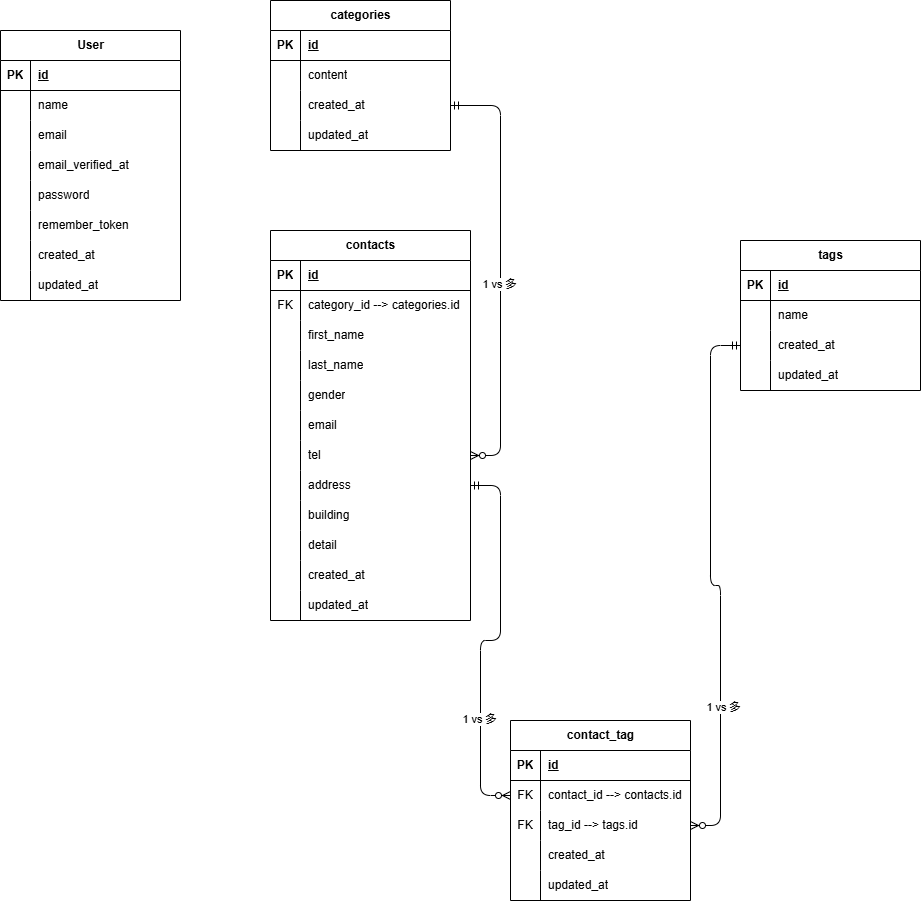

# プロジェクト名
COACHTECH お問い合わせフォーム

# 概要
- 目的
教材で学んだバックエンド技術（Laravel / DB設計 / テスト）を実践的にアウトプットし、知識の定着および復習箇所を洗い出すこと。

- 実装機能
認証: ユーザー登録、ログイン、ログアウト
お問い合わせ（一般）: 入力・確認・完了画面および送信処理
お問い合わせ管理（管理者）: 一覧・詳細表示、検索、削除、CSVエクスポート
タグ管理（管理者）: タグの追加、編集、更新、削除
API: お問い合わせのCRUD処理（一覧、詳細、作成、更新、削除）

# ER図


# 環境構築手順
1. スターターキットクローン
git clone git@github.com:Kazuki-Yamaoka/contact-form-app.git

2. プロジェクトディレクトリに移動
cd contact-form-app

3. パッケージをインストール
```bash
docker run --rm \
    -u "$(id -u):$(id -g)" \
    -v "$(pwd):/var/www/html" \
    -w /var/www/html \
    laravelsail/php82-composer:latest \
    composer install
```

4. 環境ファイルを作成
cp .env.example .env

5. sailを起動
./vendor/bin/sail up -d

6. アプリケーションキーを生成
./vendor/bin/sail artisan key:generate

7. データベースのマイグレーションとシーダーを実行
./vendor/bin/sail artisan migrate --seed

8. .env ファイルの設定
.env ファイルを開き、データベース接続情報が以下と一致していることを確認します。

DB_CONNECTION=mysql
DB_HOST=mysql
DB_PORT=3306
DB_DATABASE=laravel
DB_USERNAME=sail
DB_PASSWORD=password

重要: DB_HOST は localhost や 127.0.0.1 ではなく、Dockerコンテナ名である mysql を指定します。

9. NPM依存パッケージのインストール
> 重要: sail npm install を実行する前に、必ずSailコンテナが起動していることを確認してください。
sail npm install

10. Vite開発サーバーの起動
sail npm run dev

11. データベースのマイグレーションと初期データ投入
以下のコマンドでテーブルを作成し、初期データを投入します。
sail artisan migrate --seed

※既存のデータベースをリセットしたい場合は以下を実行してください。
sail artisan migrate:fresh --seed

12. テスト実行
sail artisan test

※Featureテストの作成まで間に合わなかったのでsail artisan testを実行する前にtests/Featureというフォルダを作成してください


# 使用技術
PHP: 8.5.9
Laravel: 10.50.3
Composer: 2.10.3
MySQL: 8.4.11
Docker: 29.7.2
Docker Compose: 5.5.0
npm: 12.0.2
Git: 2.53.0

# APIエンドポイント一覧
- GET /api/v1/contacts お問い合わせ一覧（検索・ページネーション付き）
- GET /api/v1/contacts/{contact} お問い合わせ詳細（カテゴリ・タグ含む）
- POST /api/v1/contacts お問い合わせ新規作成
- PUT /api/v1/contacts/{contact} お問い合わせ更新
- DELETE /api/v1/contacts/{contact} お問い合わせ削除

# 開発環境URL
- お問い合わせフォーム入力ページ http://localhost/contacts/
- サンクスページ http://localhost/thanks
- 管理者登録画面 http://localhost/register
- ログイン画面 http://localhost/login
- 管理画面 http://localhost/admin
- Mysql http://localhost:8080/

# 作成者
山岡 一幾